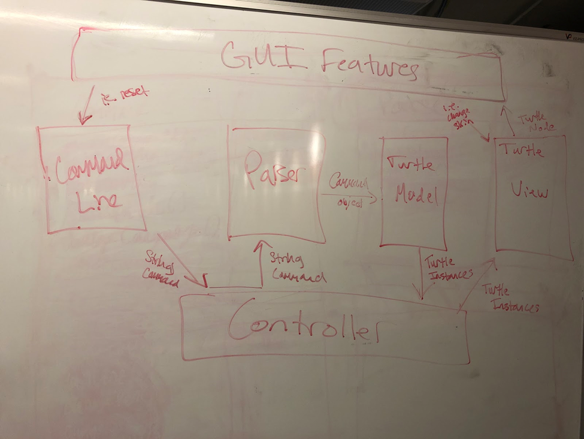
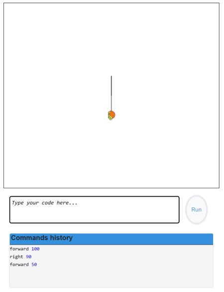

# Design Plan
#### Team members: dmh58, sk593, taj26, wg74, ns217

## Introduction

This section describes the problem your team is trying to solve by writing this program, the primary design goals of the project (i.e., where is it most flexible), and the primary architecture of the design (i.e., what is closed and what is open). Discuss the program at a high-level (i.e., without referencing specific classes, data structures, or code).

From a high level view, the goal of this project is to create a design that is flexible in several key
areas, as well as able to be easily expandable in future iterations. Specifically, our primary goal
is to make it so that the design is very flexible to new commands, such that adding them is very simple. Additionally, a key goal is to make it so that adding new visual components is simple and easy. Both of these will be supported by our goal of ensuring that both the front end and the back end have clear, defined, and discrete internal and external API's.

## Overview

The program will be divided into Model (Back-End), View (Front-End), and Controller. The Controller will create instances of the View (i.e. the GUI, and TurtleView) and the Model (i.e. Parser), and will handle communication between the two. 
For the case when the user inputs a command, the CommandLine will read this command, sending a String to the Controller. The Controller will forward this String to the Parser, which will parse through the commands and convert them into Command implementation instances, passing this to TurtleModel, which will ?execute? these commands, converting them into a Collection of TurtleStatus instances. The Controller will take this Collection and return them to the TurtleView of the View, allowing the turtle?s position and status to be updated.

### Frontend Internal API:

The goal of the internal front end API will be to construct various components of the UI that can be easily modifiable, easily accessed, and easily extended by future users. Thus, the internal API should make simple changes around these features and adding new ones. In addition, of course, it will be necessary for the internal API to handle or carry out to fruition the executable actions that the back end determines and gives to the front end via its external API. Additionally, it will be important that the internal API generally relies as little as possible on the specific implementation at hand (JavaFX) such that it could be used in future front end implementations that someone else might want to use.

### Frontend External API:

The external API on the front end should be responsible for sending the command to the backend side. This will allow the backend side to use the command to move the turtle. The external API on the front end will be contained in the CommandLine class, which will not only read in commands with readCommands(), but will store commands until they are run, and upon the run it will send commands as strings to the controller. Thus the primary goal of taking in and handling user input, then sending it to the user is achieved.

### Backend Internal API:

The goal of the internal API on the back end is to facilitate the conversion of Strings representing commands into TurtleStatus instances. This will be accomplished by first parsing the Strings into Command implementation instances, which can then be ?executed? by the TurtleModel to update its status and create these TurtleStatus instances. The front end should not need to know how this processing is handled internally, it just needs to know how to convert TurtleStatus instances into meaningful visual updates.

### Backend External API:

The goal of the external API on the backend will be to communicate with the frontend visualization so that the GUI reflects calculations and changes made on the backend. Much of these commands for the backend will be contained in the TurtleModel, which will necessary have to communicate to the Controller the resulting TurtleStatus instances from the parsing of the command in the Parser and executing the command in the BackendInternalAPI. The Backend external API will also have to communicate to the front end whether or not a command is valid - meaning that error handling will result in communication between the front and back end via the external API.

## User Interface

This section describes how the user will interact with your program (keep it simple to start). Describe the overall appearance of program's user interface components and how users interact with these components (especially those specific to your program, i.e., means of input other than menus or toolbars). Include one or more pictures of the user interface (these pictures can be hand drawn and scanned in, created with a standard drawing program, or screen shots from a dummy program that serves as an exemplar). Also describe any erroneous situations that are reported to the user (i.e., bad input data, empty data, etc.). This section should go into as much detail as necessary to cover all your team wants to say.

The user will interact with the program through the GUI. The GUI will essentially contain two different sections: one for the commands and one for displaying the turtle. On the command side, There will be a text box that users can input their commands into and either click run or enter to execute the command. There will also be a display box underneath the text box that holds the history of the commands that the user has entered. On the other side of the display, we?ll have a screen that shows the turtles movements. This will display both the turtle and the path that it has taken depending on the commands entered. There will also be a place to display the variables the user has set, likely next to the command history box. Finally, the GUI will also include a Toolbar at the top of the screen with dropdowns for choosing color and languages. There will also be pop ups if the command that is entered is not a valid command (or it?ll display right above the box). The user will then be able to input another command. 

## Design Details

### Frontend Internal API:

The goal of the internal front end API will be to construct various components of the UI that can be easily modifiable, easily accessed, and easily extended by future users. Thus, the internal API should make simple changes around these features and adding new ones. In addition, of course, it will be necessary for the internal API to handle or carry out to fruition the executable actions that the back end determines and gives to the front end via its external API. Additionally, it will be important that the internal API generally relies as little as possible on the specific implementation at hand (JavaFX) such that it could be used in future front end implementations that someone else might want to use.

### Frontend External API:
The external front end API is used to create components on the UI in such a way that they?re modifiable and accessible. The external API is responsible for sending data about commands to the back end side. This allows the external API to only handle processing of the commands and displaying them instead of actually deconstructing them. 

### Backend Internal API:

The internal API execute the commands parsed by the Parser and asks the TurtleModel to generate a list of TurtleStatus instances accordingly

### Backend External API:

The external API for the back end ensures that all internal implementation is hidden. This means that the only open components of the back end include TurtleStatus, in which information about a turtle is given, and Parser, which allows String commands to be parsed into TurtleStatus instances. Thus, the external API is set up such that information can be extracted from TurtleStatus and such that Parser can take in String commands or sets of String commands. 

## API as Code

### Frontend Internal API:
1. TurtleView
    - Void executeStatus(TurtleStatus t)
    
    Executes the command that the user enters by doing the action specified in the command
    - Void updateX(int x), updateY(int y)
    
    Updates the value of the x and y positions of the turtle as it moves
    - Void updateBearing(int degrees)
    
    Updates the current direction of the turtle by given degree increment
    - Void changeSkin(String filename)
    
    Changes image used for turtle
    - Void draw(Point start, Point end)
    
    Draws a line that is visible on UI from starting point to ending point on a straight line
    - Void penUp(), penDown()
    
    Changes whether or not draw() is called when turtle moves

### Frontend External API:
1. CommandLine
    - Void readCommand(String input)
    
    Stores command from user input in current set of runtime commands
    - String getCommands()
    
    Returns all current runtime commands
    - Void updatePastCommands()
    
    Stores commands that have been sent in history
    
    Removes these commands from current runtime set
    - Void clearCommands()
    
    Clears all current and past runtime commands

### Backend Internal API:
1. Parser
    Used for parsing Strings into Commands.
	- Collection<Command> parseLine(String s)
    
    Parses a singular command String, which may include multiple commands, and returns their parsed output as a Collection of one or more commands.

2. TurtleModel 
    Used for modeling the motion of the turtle on the back-end, by ?executing? Commands.
	- Collection<String> getVariables()
	
	Returns a Collection of the defined variables for this runtime environment.
	- void clearVariables()
	
    Clears all variable previously defined by user
	- Collection<NestedCommand> getFunctions()
	
	Returns a Collection of the defined functions for this runtime environment.
    - TurtleStatus createStatus(Command c)

    Parses a singular command to return a TurtleStatus instance by calling Command?s execute method.
	- Collection<TurtleStatus> updateStatus(Collection<Command> c)
    
    Takes in a collection of String commands and converts them into a Collection of Command implementation instances. 	

3. Interface Command
    Used for defining norms for commands to execute to create new TurtleStatus instances. Each command must implement this interface to provide its own functionality.
	- TurtleStatus execute (TurtleStatus ts)

    A command will use its instance variables, and the previous TurtleStatus instance to generate and return a new TurtleStatus instance.
	- Number returnValue()
	
	Returns the value that results from executing some commands.

4. Interface NestedCommand implements Command
    Used for defining commands that may have nested components, such as loops, conditionals, or functions.
	- Collection<Command> getChildren()
    
    Returns a NestedCommand instance?s children, held within its brackets.
	- Collection<Command> getAllChildren()

    Returns a NestedCommand instance?s children and recursively calls its children?s getChildren() methods.

### Backend External API:
1. TurtleStatus
    
    A data class for storing information about a turtle?s status, to be returned from the back end and used for updating the front end?s visualization.
    - int getX()
	
	Returns the int for the turtle?s x-direction.
	- int getY()
	
	Returns the int for the turtle?s y-direction.
	- int getBearing()
	
	Returns the int for the turtle?s direction, starting North and going clockwise.
	- boolean getSmooth()
    
    Returns whether or not the line should be drawn smoothly, with animation, or in a single step.
	- void clearVar()
	
	Clears the stored variables
	- Map<String,Number> getVars()
    
    Returns a Map of any variables created by a command?s execution, to be read and forwarded to a variable explorer if desired.

2. Parser throws InvalidCommandError
    
    The hub of the back end that takes Strings and turns them into Commands and TurtleStatus instances.
	- void validateCommand(String s) throws InvalidCommandError
    
    Checks if a given command is recognized as a possible command. If not, throws error.
	- Collection<TurtleStatus> parseCommands(Collection<String> commandStrings)
    
    Takes in a collection of String commands and converts them into a Collection of TurtleStatus instances.
    Catches and handles invalid command errors by not executing commands and returning to Controller with the error, which in turn will update the GUI

## Design Considerations

TurtleView and TurtleModel
We discussed at length the various places where the Turtle might be stored, and how best to distribute its tasks since it depends so heavily on both the front and back end. We considered having the Turtle stored in the front end, with it keeping all knowledge of its position, bearing, etc. in the front end, but then updating itself based on commands from the parser. However, we decided that splitting the Turtle into a view and a model would allow for a better delineation between the front and backend, and make it such that the turtle can both make decisions on how to execute commands on itself as well as update itself iteratively via TurtleStatus instances, which are essentially incremental/serialized commands.

How to execute commands for the Turtle - TurtleStatus Instances
Another critical design decision came about with regards to how commands would be translated into some executable piece of information for the turtle. We ended up deciding to do this with a TurtleStatus object, which essentially represents a unit of a command. As such, a given command can be broken up into multiple TurtleStatuses, and by breaking down the commands in this way it means that the TurtleView can interact with these simple TurtleStatus commands which then allow it to process any number of commands very easily. This was chosen over alternatives, such as the TurtleModel having to query the TurtleView for information such as current position/bearing or the View having to do calculations based on some command as it very clearly breaks up the frontend and backend and encapsulates the model and view. It additionally allows for great variation, as commands can be written as series of TurtleStatuses, which means that adding new commands is very flexible in this regard, as it is the case that if the basic TurtleStatus instances are coherent and well designed that they should cover feasibly most commands that would like to be added.

Where to store functions, variables
We had an in depth discussion as to where it made the most sense logistically as well as logically to store the various variables or functions the user defines. We started off discussing that they be stored in Controller, since it has access to everything and this would be very simple. However, this seemed like a solution that was, while simple, not ideal, as it did not respect the functionalities of the various components. We then decided that they should be stored somewhere in the backend, either in Parser or in the Model. We discussed Parser originally, but ended up deciding to place it in the Model so that it has proximity to the calculations and commands that are going to be created as a result of being called.

Executing Multiple Commands
This covers the case where the user enters multiple commands. We needed a way to run the commands sequentially and within the same round so the 2nd, 3rd, etc commands don?t get lost. Our idea is to have a list of commands and for each command the user enters, we add it to a list of commands. At each increment of the timeline, we check to see if there?s another command in the list. If there is, we execute the command and then remove it from the list. Once the list is empty, we stop the execution and wait for the next command. Our initial idea was to just run through the list in order, but we realized that this might make it seem like only one command was executed (because they?re done immediately after one another). We decided a better idea would be to base it off the Timeline so that at every ?x? number of seconds, we execute the next command. Then you can see each command the user enters being executed rather than seeing them all at once. 

## Team Responsibilities

Lucy - Backend
Tyler - Backend
Shruthi - Frontend
Dennis - Backend/Controller
Nevzat - Frontend
