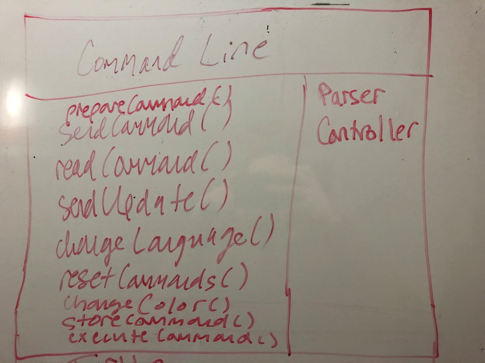
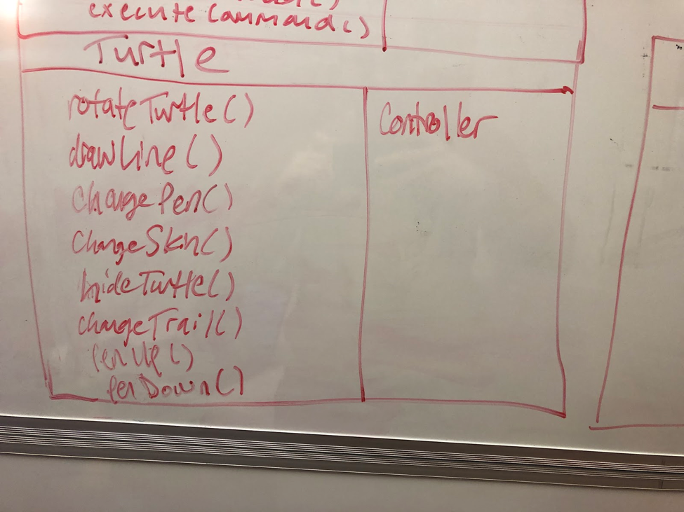
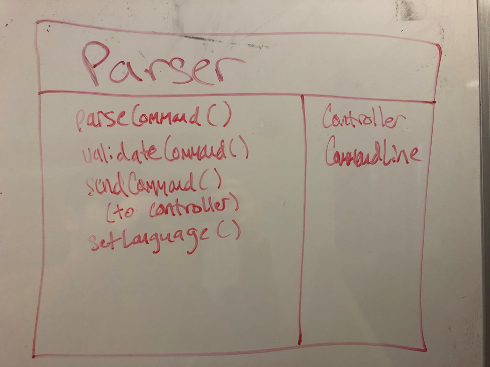

NetID:  sk593, taj26, wg74, dmh58

## Front end

### External:
* Overview:
    - The external API on the front end should be responsible for 
    sending the command to the backend side. This will allow the backend 
    side to use the command to move the turtle. The API should also be able 
    to communicate that there are errors in parsing the command. 
    
* Methods
    - sendCommand()
        * This will send the command to the backend side of the project
    - readCommand()
        * This will read in the command so that it can be sent to the back end 
    - sendUpdates()
        * This will send information on whether the user changes the color of the 
        pen or turtle. This method will likely be split up into helper methods that 
        handle each GUI element
    - sendPen()
    - sendTurtleImage()
    - sendColor()
    - changeLanguage()
        * The will tell the backend side to update the language settings depending on the user choice
    - resetCommands()
        * This will signal the back end side allow the user to clear any commands 
        that have been inputted previously

### Internal:
* Goals:
    - The goal of the internal front end API will be to construct various components of 
    the UI that can be easily modifiable, easily accessed, and easily extended by future users. 
    Thus, the internal API should make simple changes around these features and adding new ones. 
    In addition, of course, it will be necessary for the internal API to handle or carry out to 
    fruition the executable actions that the back end determines and gives to the front end via its 
    external API. Additionally, it will be important that the internal API generally relies as little 
    as possible on the specific implementation at hand (JavaFX) such that it could be used in future 
    front end implementations that someone else might want to use.
   

* Example Methods:
    - changeColor()
        * Alters color of pen
    - rotateTurtle(), drawLine()
        * These will change the position of the turtle on the screen and alter the appearance 
        of the front end
    - storeCommand()
        * This will store the previous command in the visible environment history
    - prepareCommand()
        * This will prepare the front end for the next command
    - executeCommand()
        * This will take some action as dictated by the back end and execute it, which might 
        involve calling some other methods in the internal API

 
## Backend 

### External: (everything front-end will need to know about the back-end)
* Overview:
    - The external interface of the back-end will need to have a central class, 
    CommandProcessor.java, that will call the necessary components internally to deliver 
    functionality to the frontend.

* Methods:
    - getVariables()
        * Returns a list of all user-defined variables based on previous commands.
    - getCommands()
        * Returns a list of all commands the user has executed.
    - getMethods()
        * Returns a list of all functions/methods that the user has defined.
    - parseCommand()
        * Takes in a Collection of Strings. Parse the string into valid commands, and 
        returns a Collection of Turtle Status instances. If command is not valid, throw an 
        Exception to display accordingly on the front end.
    - setLanguage()
        * Sets the file from which commands will be translated.
 
#### Internal: (everything the rest of back-end will need to know about the back-end)
* Overview:
    - The internal interface of the back-end will be divided into three packages.
    - Control (could be modified)
        * Will handle the delegation and control flow of each use case/functionality.
        * Will also handle setting configuration settings as needed.
    - Parsing
        * Will parse the Configuration information to determine how Commands should in turn be processed.
        * Will parse the String into Commands that can each be executed. Throws exception when 
        parsing is not possible
    - Commands
        * A Command interface will have methods like execute().
        * A NestedCommand interface will have methods like getChildren() and will implement Command.
        * Each command will implement one of these interfaces.
        * An enumerated type will store the types of allowed variables.
        
* Methods: 
    - getPosition()
        * Returns the turtle’s current position at this point in the control flow.
    - getBearing()
        * Returns the turtle’s current direction at this point in the control flow.
    - execute()
        * Returns the Collection of Points/Status of the turtle based on the execution of a command
    - getChildren()
        * Returns the Collection of commands associated with a particular nested (interface) 
        command. For example, returns the internal contents of a loop, function, or conditional.
    - clearCommands()
        * Clears the Collection of commands that have already been executed
    - reset()
        * Clear all commands in the collection, clear all the variables

### CRC Cards

 
### Use Cases
1. The user types 'fd 50' in the command window, sees the turtle move in the display window leaving a trail, and has the command added to the environment's history.

    After the user presses “ENTER,” CommandLine’s readCommand() would read the string. The Controller would call readCommand() to store the inputted commands as a string. Controller in turn calls getCommands(), which in turn passes the resulting String to Parser’s parseCommand(). The result would then be passed to TurtleModel’s executeCommands(), returning a Collection of TurtleStatus instances. These would be passed as arguments to TurtleView’s update(), causing the turtle to move.

2. The user types '50 fd' in the command window and sees an error message that the command was not formatted correctly.

    Upon the user pressing “ENTER”, readCommand() is called by the Controller from the CommandLine class, storing the command as a string. Controller calls getCommands(), which in turn receives and then passes all commands which have been entered since the last run to the Parser’s parseCommand(). This function will catch an InvalidCommandError which is thrown by the validateCommand() call within it. In this case, the error would be thrown, which in turn would result in the error message showing up in the command line, and upon enter CommandLine’s prepareNewCommand() is called to reset for a new command from the user and be able to take input again.

3. The user types 'pu fd 50 pd fd 50' in the command window and sees the turtle move twice (once without a trail and once with a trail).

    After the user presses “ENTER,” CommandLine’s readCommand() would read the entire string. The Controller would take the result of readCommand() and pass it to Parser’s parseCommand(). The result would then be passed to TurtleModel’s executeCommands(), returning a Collection of TurtleStatus instances. These would be passed as arguments to TurtleView’s update(), causing the turtle to move, in two discrete steps.

4. The user changes the color of the environment's background.

    After entering the choice to change the color, changeColor() is called by the Controller in the CommandLine class. This method would update the color of the background in the environment.

 

